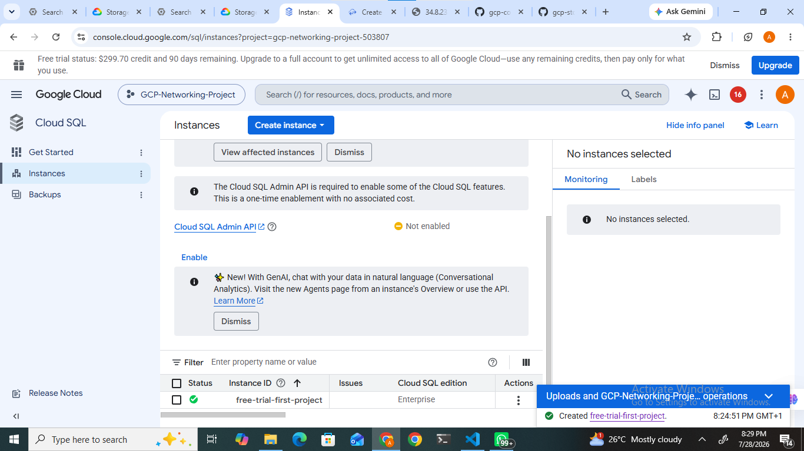
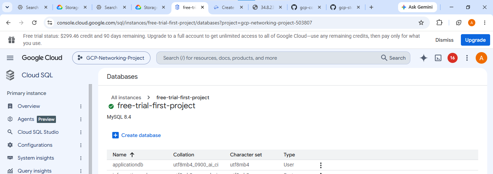
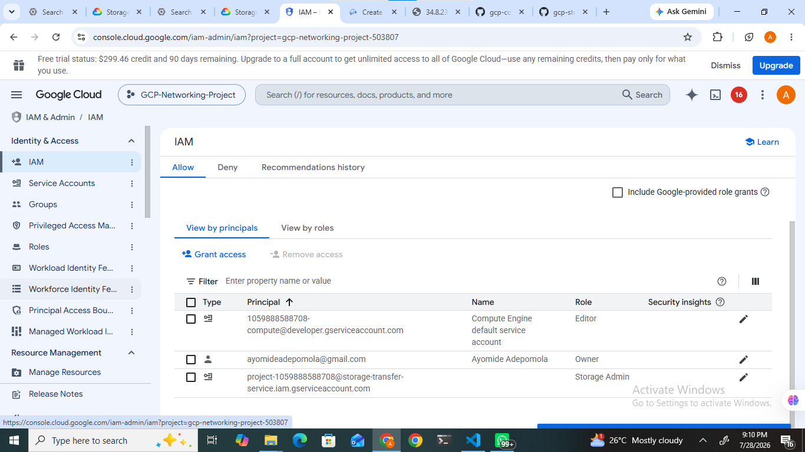
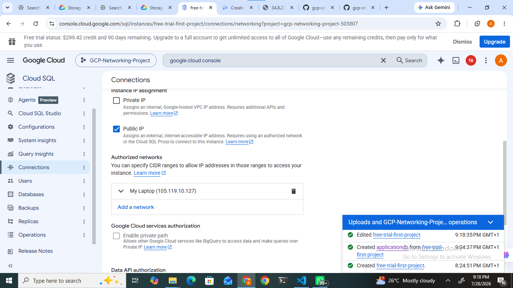
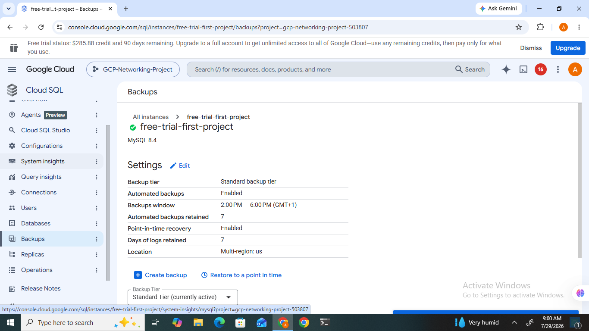
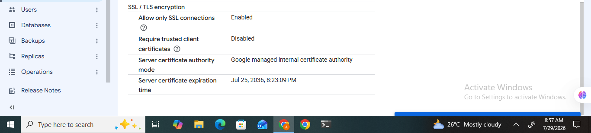
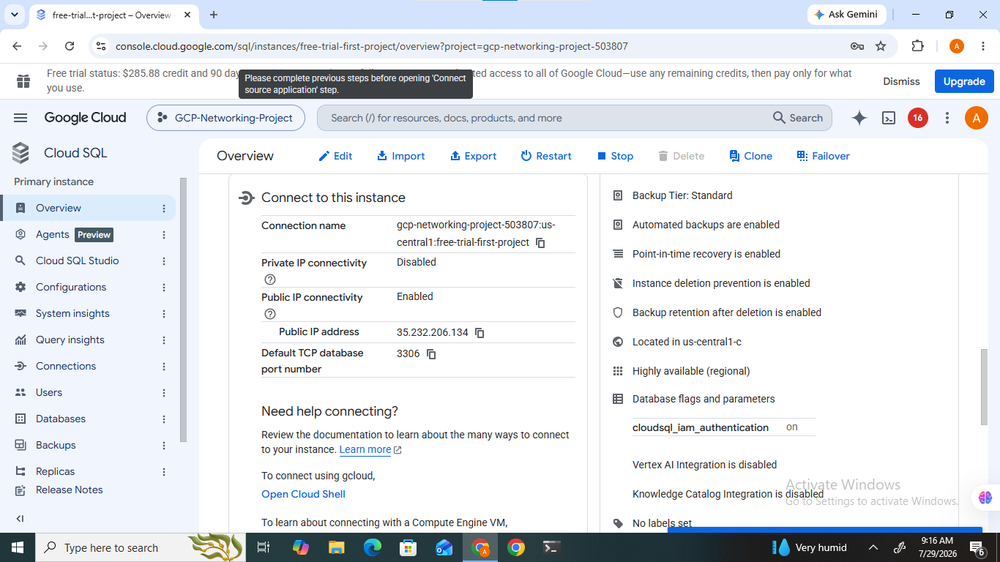

# Deploying and Managing a Database on Google Cloud Platform (GCP)

## Project Overview

This project demonstrates the deployment, configuration, and management of a relational database using *Google Cloud SQL* on *Google Cloud Platform (GCP)*. The implementation focused on building a secure, highly available, and scalable MySQL database environment by leveraging Google Cloud's fully managed database service.

Throughout the project, a Cloud SQL instance was provisioned, a MySQL database was created, security controls were configured using Identity and Access Management (IAM), Secure Socket Layer (SSL/TLS) encryption was enabled, authorized client networks were configured, automated backups were enabled, and the database connection information was verified for application integration.

Unlike traditional database deployment where database administrators are responsible for operating system updates, database maintenance, backups, and security patches, Cloud SQL automates these operational tasks, allowing developers and cloud engineers to focus on application development while maintaining security, reliability, and performance.

This project demonstrates practical cloud database administration skills and follows Google Cloud security best practices for deploying managed database services.

---

# Project Objectives

The primary objectives of this project were to:

- Deploy a fully managed MySQL database instance using Google Cloud SQL.
- Configure an appropriate machine type and storage allocation.
- Create a relational database within the Cloud SQL instance.
- Configure database security using Google Cloud IAM.
- Restrict database access using Authorized Networks.
- Enable SSL/TLS encryption for secure communication.
- Configure automated database backups.
- Review high availability and disaster recovery options.
- Verify application connectivity using Cloud SQL connection details.
- Gain practical experience managing cloud-hosted relational databases.

---

# Technologies Used

| Technology | Purpose |
|------------|---------|
| Google Cloud Platform (GCP) | Cloud Service Provider |
| Cloud SQL | Managed relational database service |
| MySQL 8.4 | Database engine |
| Identity and Access Management (IAM) | Access control |
| SSL/TLS | Secure database communication |
| Authorized Networks | Restrict client access |
| Automated Backups | Data protection |
| Google Cloud Console | Resource management |

---

# Project Architecture

```text
                    Google Cloud Platform
                              │
                              │
                    Google Cloud SQL
                    (MySQL Instance)
                              │
          ┌───────────────────┼───────────────────┐
          │                   │                   │
          ▼                   ▼                   ▼
     Database Users     Authorized Networks   SSL/TLS Encryption
          │                   │                   │
          └───────────────────┼───────────────────┘
                              │
                              ▼
                    Automated Daily Backups
                              │
                              ▼
                  Application / Client Access
```                  


---

# Project Implementation

## Step 1: Creating the Cloud SQL Instance

The first stage of the project involved creating a *Google Cloud SQL* instance to host the MySQL database. From the Google Cloud Console, Cloud SQL was selected and a new MySQL instance was provisioned.

During deployment, the following configuration was performed:

- Database Engine: *MySQL 8.4*
- Deployment Type: *Enterprise Edition*
- Region: Selected based on project requirements
- Machine Configuration: Configured according to workload requirements
- Storage: Automatically managed by Google Cloud
- Public IP Connectivity: Enabled

After reviewing the configuration, the instance was successfully created and became available for database administration.

This managed instance provides automatic patching, maintenance, monitoring, storage management, and scalability without requiring manual server administration.

### Screenshot 1



---

## Step 2: Creating the MySQL Database

After the Cloud SQL instance was successfully deployed, a new relational database was created inside the instance.

The *Databases* section of Cloud SQL was used to create a dedicated database that would store application data. Creating a separate database within the instance improves data organization and allows multiple databases to be managed independently under the same Cloud SQL instance.

This step confirms that the Cloud SQL instance is fully operational and capable of hosting application workloads.

*Tasks Performed*

- Opened the Cloud SQL instance.
- Navigated to the *Databases* page.
- Created a new MySQL database.
- Verified that the database was successfully created.

### Screenshot 2



---

## Step 3: Reviewing IAM Permissions

To strengthen security, the project's Identity and Access Management (IAM) configuration was reviewed.

Google Cloud IAM provides centralized access management by assigning predefined roles to users and service accounts. Reviewing IAM permissions ensures that only authorized users can manage the Cloud SQL instance and associated cloud resources.

During this implementation, the project permissions were inspected to verify the assigned principals and their corresponding roles.

Applying the Principle of Least Privilege helps reduce security risks by ensuring users receive only the permissions required to perform their responsibilities.

*Tasks Performed*

- Opened *IAM & Admin*.
- Reviewed project principals.
- Verified assigned IAM roles.
- Confirmed appropriate administrative permissions.

### Screenshot 3



---

## Step 4: Configuring Database Security

Securing the database instance is a critical aspect of cloud database administration.

The Cloud SQL security settings were configured to restrict unauthorized access. Instead of allowing unrestricted internet connectivity, an *Authorized Network* was added so that only trusted client devices could establish a connection to the database.

This significantly reduces the attack surface and helps protect the database from unauthorized access attempts.

*Security Configuration*

- Configured Authorized Networks.
- Added the administrator's workstation IP address.
- Restricted external connections.
- Verified secure access configuration.

Implementing Authorized Networks is considered a cloud security best practice because it limits database access to approved IP addresses only.

### Screenshot 4



---

## Step 5: Creating and Managing Database Users

After creating the database, the database user accounts were reviewed and managed through the *Users* section of the Cloud SQL instance.

Database users are responsible for authenticating and accessing the MySQL database. Each user can be assigned specific credentials and permissions based on their responsibilities. Proper user management helps protect sensitive data by ensuring that only authorized users can access the database.

During this stage, the existing database users were reviewed to verify that authentication was properly configured.

*Tasks Performed*

- Opened the *Users* page in Cloud SQL.
- Reviewed the configured database users.
- Verified authentication settings.
- Confirmed that user management was functioning correctly.


---

## Step 6: Configuring Automated Backups

To improve database reliability and disaster recovery capabilities, automated backups were configured for the Cloud SQL instance.

Automated backups ensure that a recent copy of the database is created on a scheduled basis. In the event of accidental deletion, corruption, or system failure, backups can be used to restore the database and minimize data loss.

Google Cloud SQL manages the backup process automatically, reducing administrative overhead while improving data protection.

*Tasks Performed*

- Opened the *Backups* configuration page.
- Verified that automated backups were enabled.
- Reviewed the backup configuration.
- Confirmed backup protection for the Cloud SQL instance.

### Screenshot 6



---

## Step 7: Enabling SSL/TLS Encryption

To secure communication between client applications and the Cloud SQL instance, SSL/TLS encryption was enabled.

SSL/TLS encrypts data transmitted between the client and the database server, protecting sensitive information such as usernames, passwords, and application data from interception during transmission.

The Cloud SQL security configuration confirmed that only encrypted SSL connections were permitted, ensuring compliance with security best practices for cloud-hosted databases.

*Tasks Performed*

- Opened the *Connections* page.
- Reviewed the SSL/TLS configuration.
- Verified that encrypted connections were enabled.
- Confirmed secure communication between clients and the database.

### Screenshot 7



---

## Step 8: Verifying Database Connection Information

The final implementation step involved reviewing the connection details generated by Google Cloud SQL. These connection parameters allow applications and database clients to establish secure communication with the Cloud SQL instance.

The connection information included the instance connection name, public IP address, MySQL port, and available connection methods. Reviewing these settings confirmed that the database instance was correctly configured and ready for application integration.

Google Cloud also provides secure connection methods through Cloud SQL connectors and authenticated client connections, reducing the complexity of database connectivity.

*Tasks Performed*

- Opened the *Connect to this instance* page.
- Reviewed the instance connection name.
- Verified the public IP address.
- Confirmed the default MySQL port (3306).
- Verified available client connection methods.

### Screenshot 8



---

## Step 9: Testing and Validation

After completing the deployment and configuration, the Cloud SQL environment was reviewed to verify that all project requirements had been implemented successfully.

Each component was validated to ensure proper configuration, security, and operational readiness.

| Validation Item | Status |
|-----------------|--------|
| Cloud SQL Instance Created | ✅ Completed |
| MySQL Database Created | ✅ Completed |
| IAM Permissions Reviewed | ✅ Completed |
| Authorized Networks Configured | ✅ Completed |
| SSL/TLS Encryption Enabled | ✅ Completed |
| Automated Backups Enabled | ✅ Completed |
| Connection Details Verified | ✅ Completed |

The successful completion of these validation checks confirmed that the Cloud SQL environment was correctly deployed and secured according to Google Cloud best practices.

---

# Challenges Encountered

During the implementation of this project, a few practical challenges were encountered.

### Cloud SQL Interface Changes

The Google Cloud Console has been updated significantly compared to older tutorials. Some options such as database connection methods and security settings were located in different sections of the interface.

### Connection Configuration

Instead of using the older *Connect* option available in previous versions of Cloud SQL, the new interface provides *Connect to this instance*, which displays the required connection information for client applications.

### Security Configuration

Properly configuring Authorized Networks and SSL/TLS encryption required understanding how Google Cloud secures database connectivity by allowing only trusted clients and encrypted communication.

These challenges provided valuable experience navigating updated cloud interfaces and applying modern cloud security practices.

---

# Best Practices Implemented

Throughout this project, several Google Cloud best practices were followed, including:

- Deploying a managed relational database using Cloud SQL.
- Applying the Principle of Least Privilege through IAM.
- Restricting access using Authorized Networks.
- Enabling SSL/TLS encrypted connections.
- Configuring automated backups for disaster recovery.
- Using Google-managed database maintenance and monitoring.
- Following secure cloud database deployment practices.

---

# Skills Demonstrated

This project provided practical experience with the following technologies and concepts:

- Google Cloud Platform (GCP)
- Cloud SQL
- MySQL Database Administration
- Identity and Access Management (IAM)
- Database Security
- SSL/TLS Encryption
- Authorized Networks
- Automated Backups
- Managed Database Services
- Cloud Infrastructure Management
- Database Connectivity
- Cloud Security Best Practices

---

# Project Outcome

This project successfully demonstrated the deployment and secure management of a relational database using Google Cloud SQL.

A fully managed MySQL instance was provisioned, a database was created, IAM permissions were reviewed, network access was restricted using Authorized Networks, SSL/TLS encryption was enabled, automated backups were configured, and database connection details were verified.

The implementation provided practical experience with enterprise cloud database management while reinforcing security, availability, and operational best practices used in production cloud environments.

---

# Conclusion

Deploying and managing databases in the cloud requires careful attention to security, availability, and operational efficiency. Through this project, a secure MySQL database environment was successfully implemented using Google Cloud SQL while leveraging Google Cloud's managed services to simplify administration.

The project demonstrated how managed databases reduce administrative overhead by automating maintenance, backups, monitoring, and scaling, allowing developers and cloud engineers to focus on application development rather than infrastructure management.

Overall, this project strengthened practical skills in cloud database deployment, database security, backup strategies, and managed database administration, providing valuable hands-on experience with one of Google Cloud Platform's core database services.

---

# References

The following official Google Cloud documentation was referenced throughout this project:

- [Google Cloud SQL Documentation](https://cloud.google.com/sql/docs)
- [Google Cloud SQL for MySQL Documentation](https://cloud.google.com/sql/docs/mysql)
- [Google Cloud Identity and Access Management (IAM) Documentation](https://cloud.google.com/iam/docs)
- [Google Cloud SQL Backup and Recovery Documentation](https://cloud.google.com/sql/docs/mysql/backup-recovery)
- [Google Cloud SQL Connectivity Documentation](https://cloud.google.com/sql/docs/mysql/connect-overview)
- [Google Cloud Security Best Practices](https://cloud.google.com/security/best-practices)
- [Google Cloud Architecture Framework](https://cloud.google.com/architecture/framework)
- [Google Cloud SQL Overview](https://cloud.google.com/sql)

---

# Author

*Adepomola Ayomide*

 | DevOps & Cloud Computing Learner*

This project was completed as part of a hands-on Google Cloud Platform (GCP) laboratory focused on deploying, securing, managing, and maintaining relational databases using Google Cloud SQL.